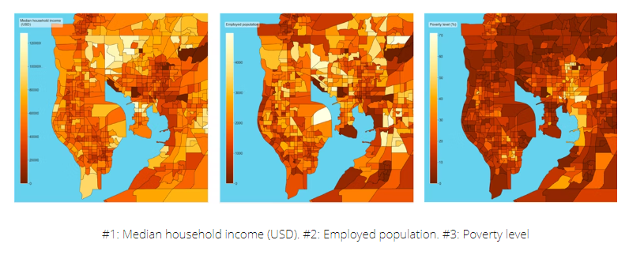
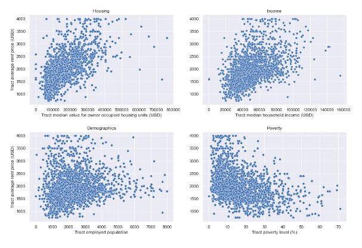

# Assignment - Workflow for AI-project

The goal of this report is to attempt to describe a workflow to get an overview of the most common steps in creating a machinelearning application. In this example the application will attepempt to get an overview of the price ranges of houses. The price ranges will be based on different features such as amount of rooms, sieze, location. 

To begin the process we research if this has been done before, which it most likley has. Similiar applications has been done by people trying on Kaggles competition [^source4] regarding the same subject.    

In order to gather data, depending on the scale and budget of the project we can approach it in a few different ways. If its a large project with a high budget we could pay for already collected data to use in our machinelearning module. One advantage to this method is we get alot of data quickly and is less time consuming that collecting it ourselfs. If we however wish to gather the data ourselves then tryo labs [^source5] has written an indepth guide on how we could approach this. Everything from maps, pictures, house sieze, neighboorhood school, rents, emergency service, socioeconmic enviroments and more would need to be collected.  

Tryo labs recommend utilizing a great variety of sources for this data, the more sources, the more data, the more data the more accurate our application will become. One soild example from tryo labs is the usage of Mapboxs Satellite API [^source6] which allows the user to query any location by coordinates with 50 000 requests per month. This provides a solid amount of data to feed the machinelearning.

Other data such as demographic variables are a little more tricky, we cant just feed satellite images for this. In Try Labs example they are gathering data on house values in the United States, where they utilize "American Community Survey" (ACS) [^source7]. Since they gather monthly surveys on income, education, employment, vacant housing etc they would be a great source for demographic data. ACS measure census tract level, which are small subdivisions of a county. In order to display all this data we can utilize heatmaps.

Using the heatmaps we can explore the correlation between the variablies and what ever our target might be. This is where linear regression comes into play.

Linear regression analysis is commonly used as a tool to predict the value of X varible compared to Y variable. Where you try to predict one X, which is usually refered to as the "dependent variable", compared to the "Y" variable, which is usually known as the independent variable. This is possible by comparing the dependent variable to the independent variable. By utilizing this form of analysis we can estimate coefficients on a linear equation. Linear regression minimizes the discrepanices between the predict and the actual output of the values.  

Once we have succesfully gathered the data we will need some place to store it. There are many different storage technologies, and depends on if we aim to store large amounts of data over a longer period of time, or if we just want a way to process it quickly. According to TechTarget [^source8], the quickest way to to process data is to store it in memory as dynamic RAM (DRAM). DRAM operates at nanoseconds speed, the issue being memory capacity. Even with several TB of DRAM it would be to small to process any large amounts of machine learning. TechTarget brings up three possible storage solutions: 

- block-based storage
- file-based storage
- object storage

In short, block-based storage provides the lowest latency for input and output. However it lacks in scalability for larger projects. File-based storage provides scalability, but lacks in peformance. Finally, Object storage offers the best scalablity and is somewhat easier to access since it utilizes the HTTP(S) protocol. But lacks a bit on peformance and latency. There for, we would either need to pick one depending on the scale of the project, or if possible use a mix of all data storage options above. 

Now that we know what to store and where to store it. Now we need to figure out in what format should we store it? It is most likley that the data we recive will be in raw format, which will need to be processed. This will then need to be converted to a more worker friendly format. There are multiple programs and webbsites which will provide this service. For example PDF Mall[^source10] allows you to upload your RAW data files and convert them to CSV files. Of course, depending on the scale of the project you may need to use something more powerful if your processing larger amounts of data. Once it has been converted into a CSV file we can follow Python basics [^source12] tutorial on how to load the CSV file into Python if we so wish.    

Data for machine learning typically uses csv files. They are text based and contains comma seperated values. This format is quite popular according to Towards Data Science [^source9] as they are easy to view and debug. Along with also being easy to read and write from programs without compression or indexing.

With the data collected, it has been stored in one or multiple storage systems, the data convereted into a CSV file and maybe also loaded into Python it is time for deployment. According to Towards Data Sience [^source11] the simplest way to deploy a machinelearning model is as a web service.  

### Soruces

1. [^source1] topflight:  Machine Learning Mobile App Development: All the Whys and Hows

2. [^source2] Nivida:  machine learning guide

3. [^source3] Towards Data Sience: Predicting House Prices with Machine Learning

4. [^source4] Kaggle:  House Prices - Advanced Regression Techniques

5. [^source5] Tryo Labs: Real Estate pricing with Machine Learning & non-traditional data sources

6. [^source6] Mapbox Imagery

7. [^source7] American Community Survey: ACS

8. [^source8] TechTarget: SearchStorage

9. [^source9] Towards Data Sience: Guide to File Formats /.../

10.[^source10] PDF Mall: RAW to CSV converter

11. [^source11] Towards Data Sience: 3 Ways to Deploy Machine Learning /.../

12. [^source12] Python Basics: How to load Machine Learning Data in Python

---

[^source1]: https://topflightapps.com/ideas/how-to-create-a-machine-learning-app/

[^source2]: https://developer.nvidia.com/blog/step-by-step-guide-to-building-a-machine-learning-application-with-rapids/

[^source3]: https://towardsdatascience.com/predicting-house-prices-with-machine-learning-62d5bcd0d68f

[^source4]: https://www.kaggle.com/competitions/house-prices-advanced-regression-techniques/overview/tutorials

[^source5]: https://tryolabs.com/blog/2021/06/25/real-estate-pricing-with-machine-learning--non-traditional-data-sources

[^source6]: https://www.mapbox.com/maps/satellite

[^source7]: https://www.census.gov/programs-surveys/acs

[^source8]: https://www.techtarget.com/searchstorage/feature/Storage-strategies-for-machine-learning-and-AI-workloads

[^source9]: https://towardsdatascience.com/guide-to-file-formats-for-machine-learning-columnar-training-inferencing-and-the-feature-store-2e0c3d18d4f9

[^source10]: https://pdfmall.com/raw-to-csv

[^source11]: https://towardsdatascience.com/3-ways-to-deploy-machine-learning-models-in-production-cdba15b00e

[^source12]: https://pythonbasics.org/how-to-load-machine-learning-data-in-python/

