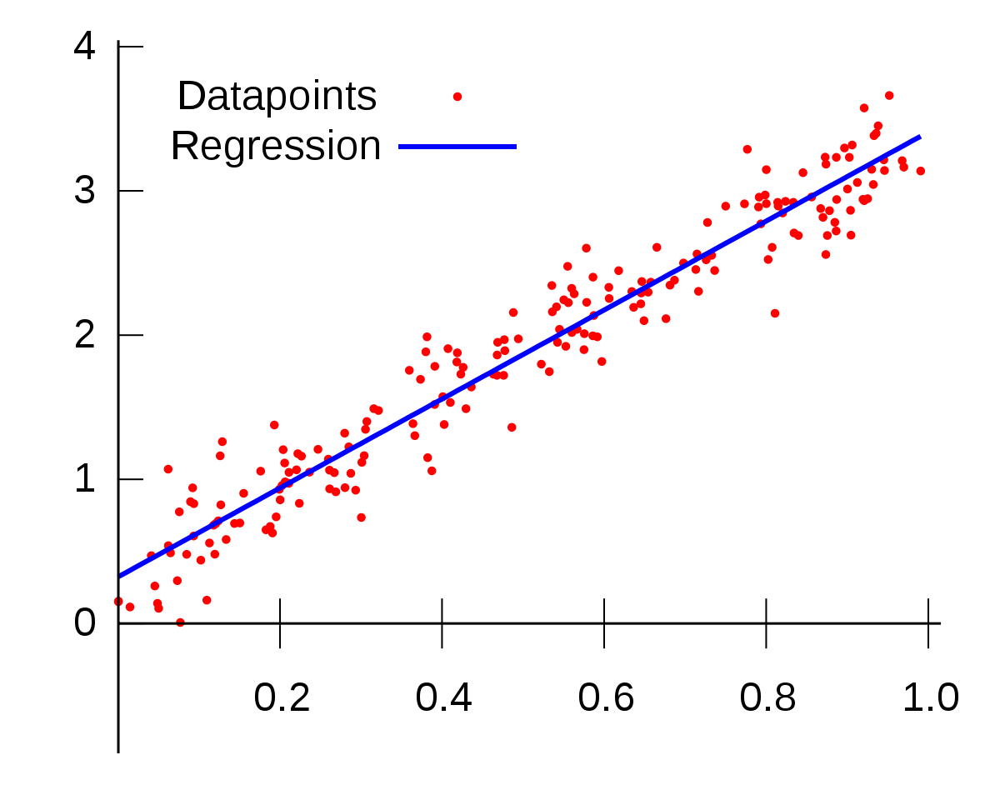

# Assignment - Workflow for AI-project

The goal of this report is to attempt to describe a workflow to get an overview of the most common steps in creating a machinelearning application. In this example the application will attepempt to get an overview of the price ranges of houses. The price ranges will be based on different features such as amount of rooms, sieze, location. 

To begin the process we research if this has been done before, which it most likley has. Similiar applications has been done by people trying on Kaggles competition [^source4] regarding the same subject.    

In order to gather data, depending on the scale and budget of the project we can approach it in a few different ways. If its a large project with a high budget we could pay for already collected data to use in our machinelearning module. One advantage to this method is we get alot of data quickly and is less time consuming that collecting it ourselfs. If we however wish to gather the data ourselves then tryo labs [^source5] has written an indepth guide on how we could approach this. 

We will begin by marking up everything required 

### Soruces

[^source1] topflight:  Machine Learning Mobile App Development: All the Whys and Hows

[^source2] Nivida:  machine learning guide

[^source3] Towards Data Sience: Predicting House Prices with Machine Learning

[^source4] Kaggle:  House Prices - Advanced Regression Techniques

[^source5] Tryo Labs: Real Estate pricing with Machine Learning & non-traditional data sources

---

[^source1]: https://topflightapps.com/ideas/how-to-create-a-machine-learning-app/

[^source2]: https://developer.nvidia.com/blog/step-by-step-guide-to-building-a-machine-learning-application-with-rapids/

[^source3]: https://towardsdatascience.com/predicting-house-prices-with-machine-learning-62d5bcd0d68f

[^source4]: https://www.kaggle.com/competitions/house-prices-advanced-regression-techniques/overview/tutorials

[^source5]: https://tryolabs.com/blog/2021/06/25/real-estate-pricing-with-machine-learning--non-traditional-data-sources

